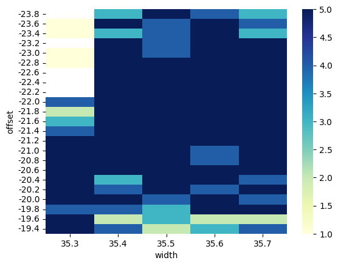

---
title: "AES 128 DFA on real target"
subtitle: "Laboratory 3"
author: [Melissa Gehring, Maxim Golay, Francesco Monti]
date: 01.06.2023
toc: false
...

## Introduction

In this laboratory,

## Setup

For this laboratory, we kept the same board as in the previous lab. In order to prepare for the AES attack, we only had to install the firware on the board, and then follow the same procedure as in previous lab. We show the very impressive setup on the Figure 1 below :

Once everything was connected and ready to go, we started working on the notebook to perform the attack.

## Attack methodology

During the presentation of the lab, we were shown two ways of attacking the AES algorithm. The first consisted of attacking the round 10 of the algorithm, and the second consisted of attacking the round 9. The first one was easier to understand, but required a **lot** of ciphertexts to be able to retrieve the key. The second one was more complicated to understand, but required less ciphertexts, and we could use a public python library to find the key directly from the faulty ciphertexts. We decided to go for the first option, as we wanted to understand the attack better, and we had enough time to perform it.

### Characterization

We kept the same board as in the previous lab, so we already had the good characterization parameters. We tried to run the couting loop again, with those parameters : 

| Parameter | Start value | End value | Step |
|-----------|-------------|-----------|------|
|  `offset` |    -23.8    |   -19.3   |  0.1 |
|  `width`  |     35.3    |    35.8   |  0.1 |

And without surprise we got satisfying results, as we can see on the Figure 2 below :

## Relevant faulted ciphertexts

## AES Key

`HEIG{XXX}`

## Conclusion

To conclude, 