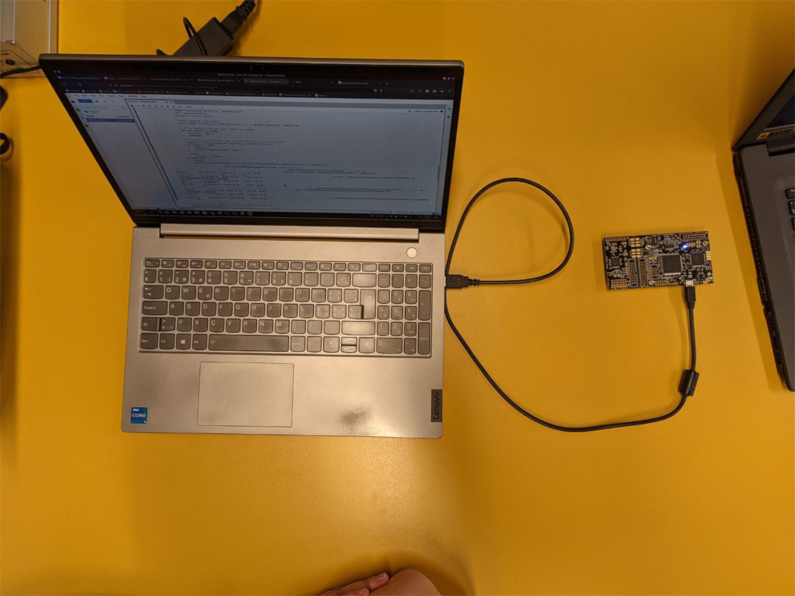

---
title: "AES 128 on real target"
subtitle: "Laboratory 3"
author: [Melissa Gehring, Maxim Golay, Francesco Monti]
date: 01.06.2023
toc: false
...

## Introduction

In this laboratory,

## Setup

To prepare for the laboratory, we first had to connect the board to the computer, as we can see on the Figure 1 below :

Once everything was connected and ready to go, we started working on the notebook to perform the attack.

## Attack methodology

## Relevant faulted ciphertexts

## AES Key

`HEIG{XXX}`

## Conclusion

To conclude, 